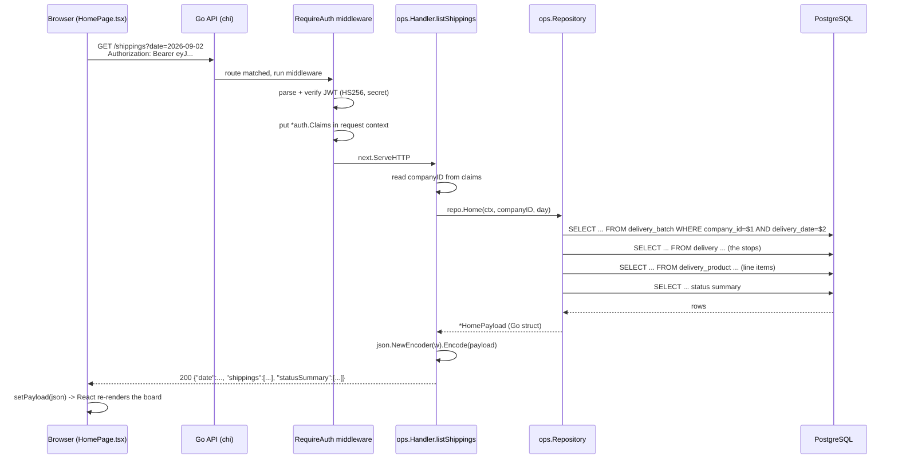
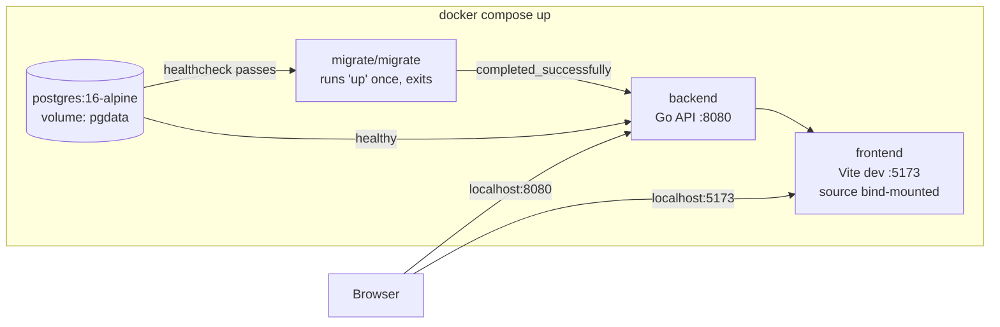

# Delivery Management System — a full walkthrough

> A learning-oriented tour of the whole project: how it is wired, why each
> piece is there, how data flows from a click to the database and back, and
> what a project like this looks like from an empty folder to a deployed
> service.
>
> Companion to [`PROJECT.md`](./PROJECT.md). `PROJECT.md` is the "where did
> we leave off" reference; this file is the "how does it all actually work,
> and how would I build one myself" guide. Written 2026-09-02.

---

## Table of contents

1. [The 10,000-foot view](#1-the-10000-foot-view)
2. [The stack, and why each piece](#2-the-stack-and-why-each-piece)
3. [From empty folder to running app — the bootstrap](#3-from-empty-folder-to-running-app--the-bootstrap)
4. [The backend, layer by layer (the "MVC" question)](#4-the-backend-layer-by-layer-the-mvc-question)
5. [Authentication and tokens, end to end](#5-authentication-and-tokens-end-to-end)
6. [The database and migrations](#6-the-database-and-migrations)
7. [The frontend, and how data gets loaded](#7-the-frontend-and-how-data-gets-loaded)
8. [Docker Compose, service by service](#8-docker-compose-service-by-service)
9. [Testing](#9-testing)
10. [From here to deployed (conceptually)](#10-from-here-to-deployed-conceptually)
11. [A reusable checklist for your next project](#11-a-reusable-checklist-for-your-next-project)
12. [Where to go deeper](#12-where-to-go-deeper)

---

## 1. The 10,000-foot view

### What the system does

It is a **multi-tenant delivery-operations app**. "Multi-tenant" means one
running instance serves many isolated companies; every row in the database
carries a `company_id`, and every query filters on it. There are two kinds
of user:

- **Dispatcher / Admin** — plans the day on a web board: create a
  *shipping* (one driver's route for one date), add *deliveries* (stops)
  to it, reorder them by drag, attach product line items.
- **Driver** — runs the route on a phone: sees assigned shippings, opens a
  stop, gets directions, contacts the customer, starts the delivery, and
  closes it with an outcome (complete / absent / trouble).

Vocabulary note: the UI word **"shipping"** is the table `delivery_batch`.
A **"delivery" / "stop"** is the table `delivery`.

### The three processes that make it run

```
┌─────────────┐        HTTP/JSON        ┌─────────────┐      SQL (TCP)     ┌────────────┐
│  Browser    │  ───────────────────▶   │  Go API     │  ──────────────▶  │ PostgreSQL │
│  (React SPA)│  ◀───────────────────   │  (:8080)    │  ◀──────────────  │  (:5432)   │
└─────────────┘                         └─────────────┘                    └────────────┘
    Vite dev server                       chi router +                     one database,
    serves the JS/CSS                     pgx connection pool              every table has
    (:5173)                                                               a company_id
```

Nothing is server-rendered. The browser downloads a JavaScript bundle
once, and from then on the page is drawn by React in the browser; it talks
to the Go API purely over `fetch()` calls that send and receive JSON.
The Go API holds no session state in memory — every request re-proves who
you are with a token (see §5). PostgreSQL is the only thing that
remembers anything between requests.

### The request lifecycle, concretely

When the dispatcher board loads, this happens:



Every protected endpoint follows that same shape: **middleware proves
identity → handler validates input and reads the tenant id → repository
runs SQL → handler encodes JSON**. Learn that one path and you understand
the whole backend.

---

## 2. The stack, and why each piece

| Layer | Choice | Why this and not something else |
|---|---|---|
| **Language (API)** | Go 1.23 (toolchain 1.24.2) | Compiles to a single static binary, no runtime to install, fast, strong standard library for HTTP. Great for a small service. |
| **HTTP router** | `go-chi/chi/v5` | Standard-library-compatible (`http.Handler`), tiny, gives you URL params (`/shippings/{id}`) and middleware groups. Not a framework — no magic. |
| **CORS** | `go-chi/cors` | The browser blocks cross-origin requests (`:5173` → `:8080`) unless the server opts in with headers. This middleware sets them. |
| **DB driver** | `jackc/pgx/v5` (`pgxpool`) | The best-supported PostgreSQL driver for Go. Used directly (no ORM) — you write SQL, you scan rows into structs. |
| **Auth** | `golang-jwt/jwt/v5` + `golang.org/x/crypto/bcrypt` | JWT for stateless request auth; bcrypt to store passwords as slow, salted hashes. |
| **Database** | PostgreSQL 16 | Relational data with real foreign keys, transactions, `NUMERIC` money, UUID generation. |
| **Migrations** | `golang-migrate/migrate` | Plain numbered `.sql` files, applied in order, each with an `up` and a `down`. No ORM-generated schema. |
| **Frontend framework** | React 19 + TypeScript | Component UI + a type system that catches shape mistakes between the API and the screen. |
| **Build tool / dev server** | Vite 8 | Instant dev server with hot-reload, and a production bundler. Replaces the old Create React App / webpack setup. |
| **Routing (frontend)** | `react-router-dom` v7 (`BrowserRouter`) | Maps URLs like `/d/shipping/12/stop/34` to components, all in the browser. |
| **Drag & drop** | `@dnd-kit/*` | Accessible, touch-friendly sortable lists for reordering stops. |
| **PWA** | `vite-plugin-pwa` | Generates a web-app manifest so the driver can "add to home screen". Currently manifest-only (no offline, no real icons). |
| **Styling** | Hand-written CSS + CSS custom properties | No Tailwind / no component library. A small set of design tokens in `frontend/src/index.css`, swapped for dark mode. |
| **Orchestration (dev)** | Docker Compose | One command brings up Postgres + migrations + API + frontend, wired together. |

The theme running through all of it: **small, explicit, no magic.** You
can read every layer top to bottom. That is deliberate for a learning
project — a framework like Rails or NestJS would hide the request
lifecycle you are trying to learn.

---

## 3. From empty folder to running app — the bootstrap

This is the "how did you initialize everything" section. Two parts: the
**exact sequence** for this stack, and the **general playbook** you can
reuse for the next project.

### 3.1 The repository skeleton

A monorepo: backend and frontend live in one Git repo, side by side, with
Docker Compose at the root gluing them together.

```
delivery-management-system/
├── .git/
├── .gitignore
├── .env                 # real secrets/config — git-ignored
├── .env.example         # committed template, no real secrets
├── docker-compose.yml
├── docs/
├── schema/              # source-of-truth SQL + ER diagram
├── backend/             # the Go module
└── frontend/            # the Vite/React app
```

```bash
mkdir delivery-management-system && cd $_
git init
printf "node_modules/\ndist/\n.env\n" > .gitignore
```

### 3.2 Bootstrapping the Go backend

```bash
mkdir backend && cd backend

# 1. Create the module. The path is the import prefix for every package
#    inside, and by convention matches where the code is hosted.
go mod init github.com/PatrialEduardo/delivery-management-system/backend

# 2. Make the entrypoint. cmd/<name>/main.go is the standard Go layout for
#    "this folder builds an executable".
mkdir -p cmd/api
$EDITOR cmd/api/main.go        # package main; func main() { ... }

# 3. Add dependencies as you import them, then tidy:
go get github.com/go-chi/chi/v5
go get github.com/jackc/pgx/v5
go get github.com/golang-jwt/jwt/v5
go get golang.org/x/crypto/bcrypt
go mod tidy                    # writes go.mod + go.sum, removes unused

# 4. Run it
go run ./cmd/api
```

**Go project layout used here** (a widely-followed convention, not a
language rule):

- `cmd/api/` — `package main`, the only place with a `main()`. If you
  later add a worker, it is `cmd/worker/`.
- `internal/` — all the real code. Go enforces that packages under
  `internal/` **cannot be imported by another module** — a compiler-level
  "this is private to us".
- `internal/<feature>/` — one package per concern: `config`, `database`,
  `auth`, `middleware`, `httpx`, `user`, `ops`.
- `migrations/` — numbered `.sql` files.
- `scripts/` — one-off dev tools (`hash_password.go`, `test.sh`).

`go.mod` records the module path, the Go version, and every direct/indirect
dependency with an exact version. `go.sum` is the lockfile with checksums.
Commit both.

### 3.3 Bootstrapping the Vite + React + TypeScript frontend

```bash
cd ..
npm create vite@latest frontend -- --template react-ts
cd frontend
npm install

# add the runtime libraries this app uses
npm install react-router-dom
npm install @dnd-kit/core @dnd-kit/sortable @dnd-kit/modifiers @dnd-kit/utilities
npm install -D vite-plugin-pwa

npm run dev            # dev server on http://localhost:5173
```

`npm create vite` scaffolds:

- `index.html` — the single real HTML page. It has one `<div id="root">`
  and `<script type="module" src="/src/main.tsx">`. Everything else is
  injected by JavaScript.
- `src/main.tsx` — the entrypoint: `createRoot(...).render(<App/>)`.
- `vite.config.ts` — build/dev config. This project adds the React plugin,
  the PWA plugin, a fixed port, and `watch.usePolling` (needed because
  file-change events don't cross a Docker bind mount reliably on
  Windows/WSL2).
- `tsconfig.json` + `tsconfig.app.json` + `tsconfig.node.json` —
  TypeScript config split into "project references": `app` compiles
  `src/` for the browser, `node` compiles the config files. `tsc -b`
  builds both.
- `package.json` scripts: `dev` (Vite server), `build` (`tsc -b && vite
  build` → static files in `dist/`), `lint`, `preview` (serve the built
  `dist/` locally).

**Environment variables in Vite:** only variables prefixed `VITE_` are
exposed to browser code, via `import.meta.env.VITE_API_URL`. They are
read when the dev server starts (or baked in at build time for prod) — not
at runtime in the browser. See `frontend/src/lib/api.ts:1`.

### 3.4 The general playbook (reuse this)

1. **One repo, `git init`, write `.gitignore` first.** Decide monorepo vs
   two repos. Monorepo is simpler when one team owns both.
2. **Design the data before the code.** Write the schema as plain SQL
   (`schema/dmsschema.sql` here). Draw an ER diagram. The tables are the
   spine everything else hangs off.
3. **Backend: module init → entrypoint → config from env → DB connection →
   one health endpoint.** Get `GET /health` returning `{"status":"ok"}`
   before anything else. That proves the process starts and binds a port.
4. **Wire migrations early.** Even for the first table. You never want to
   hand-edit a running database.
5. **Frontend: scaffold with the framework's official tool** (`npm create
   vite`), delete the demo content, add a router, add a typed API client
   module, build the login screen first.
6. **Containerize for dev with Compose** once the pieces exist, so
   "clone and run" is one command.
7. **Add a test that hits a real database** as soon as there is logic
   worth protecting.
8. **Only then** think about deployment (see §10).

---

## 4. The backend, layer by layer (the "MVC" question)

### Is it MVC?

**No — and that's fine.** MVC (Model-View-Controller) is a pattern from
server-rendered apps where the server builds HTML "views". This API
returns JSON; there is no view layer on the server at all — the "view" is
the React app, in a different process.

What this backend actually uses is a **layered / "handler + repository"
architecture** (sometimes called ports-and-adapters-lite, or just "clean-ish
layering"). Three responsibilities, kept in separate types/files:

| Layer | Type | Job | Where |
|---|---|---|---|
| **Transport / HTTP** | `Handler` methods | Parse the request, validate input, pick a status code, encode the JSON response. Knows about `http.ResponseWriter`. Knows *nothing* about SQL. | `internal/ops/*.go` handler funcs, `internal/auth/handler.go` |
| **Data access** | `Repository` methods | Run SQL, scan rows into structs, wrap DB errors into domain errors (`errNotFound`). Knows about `pgxpool`. Knows *nothing* about HTTP. | `internal/ops/*.go` repo funcs, `internal/user/repository.go` |
| **Wire models / DTOs** | plain structs with `json:` tags | The shapes that cross the wire. `Delivery`, `Shipping`, request bodies like `createShippingReq`. | `internal/ops/models.go`, `internal/user/model.go` |

Business rules live mostly in the **Repository** methods (e.g.
`StartDelivery` enforcing "one active stop per driver",
`internal/ops/driver.go:217`) and partly in **Handlers** (field-presence
validation). There is no separate "service" layer — for an app this size
that would be ceremony. If the rules grew, you would extract a
`service`/`usecase` layer between handler and repository.

### The dependency wiring (`cmd/api/main.go`)

`main()` is the **composition root** — the one place that constructs
concrete things and hands them to each other ("dependency injection", done
by hand, no framework):

```go
cfg := config.Load()                                   // env → Config struct
db, err := database.NewPool(cfg.DatabaseURL)           // *pgxpool.Pool, fail-fast ping
userRepo := user.NewRepository(db)                     // repo gets the pool
authHandler := appauth.NewHandler(userRepo, cfg.JWTSecret, cfg.AccessTokenTTL)
opsHandler := ops.NewHandler(db)                       // ops builds its own repo internally

r := chi.NewRouter()
r.Use(middleware.Logger)                               // log every request
r.Use(middleware.Recoverer)                            // turn a panic into 500, don't crash
r.Use(cors.Handler(...))                               // allow the frontend origin

r.Get("/health", ...)                                  // public
r.Post("/auth/login", authHandler.Login)              // public

r.Group(func(pr chi.Router) {                          // everything inside needs a token
    pr.Use(appmw.RequireAuth(cfg.JWTSecret))
    pr.Get("/auth/me", authHandler.Me)
    opsHandler.Register(pr)                            // mounts ~25 routes
})

log.Fatal(http.ListenAndServe(":"+cfg.Port, r))
```

Key ideas to internalise:

- **A `chi.Router` is just an `http.Handler`.** `http.ListenAndServe`
  doesn't know about chi. chi doesn't know about your handlers. Each layer
  only depends on the standard `http.Handler` interface.
- **Middleware is an `http.Handler` wrapping another `http.Handler`.**
  `RequireAuth` returns `func(next http.Handler) http.Handler`. It runs
  before `next`, can short-circuit (write 401 and return), or call
  `next.ServeHTTP(w, r)` to continue. See
  `internal/middleware/auth.go:14`.
- **`r.Group` + `Use`** applies middleware to a subtree of routes. Public
  routes are outside the group; protected ones inside.
- **Constructors take their dependencies as arguments** (`NewHandler(db)`,
  `NewRepository(db)`). Nothing reaches for a global. That is what makes
  the repository testable with a throwaway database (see §9).

### Package tour

| Package | Responsibility |
|---|---|
| `config` | `Load()` reads env vars into a `Config` struct. `AccessTokenTTL` is hardcoded to 15 min here. `getEnv(key, fallback)` helper. `config.go:18` |
| `database` | `NewPool(url)` opens a `pgxpool.Pool` and **pings within 5s**, returning an error if the DB is unreachable — the API refuses to start half-broken. `database.go:13` |
| `httpx` | Three shared helpers so every handler doesn't re-implement them: `WriteJSON`, `WriteError` (`{"error": "..."}`), `DecodeJSON`. `respond.go` |
| `auth` | `password.go` (bcrypt hash/check), `jwt.go` (`Claims` struct, `GenerateToken`, `ParseToken`), `context.go` (put/get claims in `context.Context`), `handler.go` (`Login`, `Me`). |
| `middleware` | `RequireAuth(secret)` — Bearer header → `ParseToken` → claims into context → `next`. Signature/expiry only; per-route role checks are separate. |
| `user` | `app_user` data access. `GetByEmail` joins `role` to also return `role_name`. `TouchLastLogin`. Deliberately thin. |
| `ops` | Everything else. `ops.go` defines `Repository` + `Handler` + `Register(r)` (the route table). Then one file per feature area: `reference.go` (statuses, drivers), `customer.go`, `product.go`, `shipping.go`, `line.go` (line items), `driver.go` (`/me/*`, start/finish). `models.go` holds every DTO. `util.go` has `addressLine()` / `deref()`. |

### A handler read in full (`listShippings`, `shipping.go:233`)

```go
func (h *Handler) listShippings(w http.ResponseWriter, r *http.Request) {
    cid, ok := requireCompany(w, r)              // 1. tenant id from JWT claims, or 401
    if !ok { return }

    day, err := normalizeDate(r.URL.Query().Get("date"))  // 2. validate/normalise input
    if err != nil {
        httpx.WriteError(w, http.StatusBadRequest, "date must be YYYY-MM-DD")
        return
    }

    payload, err := h.repo.Home(r.Context(), cid, day)    // 3. delegate to the repository
    if err != nil {
        httpx.WriteError(w, http.StatusInternalServerError, "could not load shippings")
        return
    }

    httpx.WriteJSON(w, http.StatusOK, payload)   // 4. encode the struct as JSON
}
```

That is the *entire* pattern. Every handler is a variation on those four
steps. The repository method `Home` (`shipping.go:85`) does the SQL: it
runs several queries (shippings, then their deliveries, then line items,
then a status summary), stitches them into a `*HomePayload` struct, and
returns it. The handler never sees a row or a `*pgxpool.Pool`.

### Error handling style

Repositories return **sentinel errors** (`errNotFound`, `errForbidden`,
`errActiveElsewhere`, …). Handlers translate them to HTTP with a
`switch { case errors.Is(err, errNotFound): ... }` block. See
`driver.go:264` (`startDelivery`) for the fullest example — one repo call,
six possible HTTP outcomes.

### Multi-tenancy — how isolation is actually enforced

Every `ops` repository query takes a `companyID` and puts it in the
`WHERE` clause. The `companyID` comes only from the verified JWT (`ops.go:76`
`companyID(ctx)`), never from the URL or body. There is no code path that
reads another company's data. The package doc comment says it outright
(`ops.go:1`). This is the single most important security property of the
app, and it is enforced by discipline (every query filters) rather than by
the database (no row-level security).

---

## 5. Authentication and tokens, end to end

### The mental model

The API is **stateless**. It keeps no list of "logged-in users". Instead,
on login it hands the browser a **signed token** that says "this is user
X, company Y, role Z, valid until time T". On every later request the
browser sends that token back, and the API re-verifies the signature. No
database lookup, no server memory.

The token is a **JWT** (JSON Web Token): three base64 chunks separated by
dots — `header.payload.signature`. The payload ("claims") is *readable by
anyone* (it is not encrypted, just encoded). What stops forgery is the
**signature**: `HMAC-SHA256(header + payload, secret)`. Only someone with
`JWT_SECRET` can produce a signature that verifies, so only the server can
mint valid tokens.

### The claims (`internal/auth/jwt.go:13`)

```go
type Claims struct {
    UserID    string `json:"userId"`
    CompanyID string `json:"companyId"`   // ← drives multi-tenancy
    RoleID    string `json:"roleId"`
    Role      string `json:"role"`        // human name, e.g. "Driver" / "Admin"
    jwt.RegisteredClaims                  // adds exp (expiry) and iat (issued-at)
}
```

Putting `companyId` and `role` *in the token* means the API can enforce
tenancy and do coarse role routing **without a DB round-trip on every
request**. The trade-off: if you deactivate a user or change their role,
their existing token still works until it expires (15 minutes here).

### Login, step by step (`internal/auth/handler.go:42`)

```
POST /auth/login  { "email": "...", "password": "..." }
   │
   ├─ decode JSON body; 400 if malformed or fields empty
   ├─ user.GetByEmail(email)         → joins role, returns password_hash + role_name
   │     └─ not found?  401 "invalid email or password"   (same message as wrong password —
   │                                                        don't leak which accounts exist)
   ├─ user.IsActive == false?        → 401 "this account is inactive"
   ├─ bcrypt.CompareHashAndPassword(hash, password)   → 401 on mismatch
   ├─ GenerateToken(userID, companyID, roleID, roleName, secret, 15m)
   ├─ TouchLastLogin(userID)          (best-effort, error ignored)
   └─ 200  { "accessToken": "eyJ...", "expiresIn": 900,
             "user": { "userId", "fullName", "email", "role" } }
```

`expiresIn` is **seconds** (900 = 15 min). Passwords are bcrypt, cost 10
(`internal/auth/password.go`). bcrypt is deliberately slow and salts each
hash, so a leaked `password_hash` column can't be cracked with a rainbow
table.

### Every subsequent request (`internal/middleware/auth.go:14`)

```
GET /shippings?date=...        Authorization: Bearer eyJ...
   │
   ├─ header missing "Bearer " prefix?   → 401 "missing bearer token"
   ├─ auth.ParseToken(token, secret)
   │     ├─ signing method not HMAC?      → 401  (blocks the "alg:none" attack)
   │     ├─ signature invalid?            → 401 "invalid or expired token"
   │     └─ expired (exp in the past)?    → 401
   ├─ auth.ContextWithClaims(ctx, claims)   ← claims travel with the request from here
   └─ next.ServeHTTP(w, r.WithContext(ctx))
```

Downstream, a handler does `claims, ok := auth.ClaimsFromContext(r.Context())`
(`ops.go:97` wraps this as `requireClaims`). `context.Context` is Go's
standard way to carry request-scoped values (and cancellation) down a call
chain without threading them through every function signature.

### The frontend side (`frontend/src/context/AuthContext.tsx`, `lib/api.ts`)

- On successful login, `AuthContext` stores two things in
  **`localStorage`**: `dms_access_token` (the raw JWT) and `dms_user` (the
  user object as JSON). `localStorage` survives a page reload and tab
  close.
- `lib/api.ts` `request()` reads `dms_access_token` from `localStorage`
  and adds `Authorization: Bearer <token>` to **every** call
  (`api.ts:12`).
- `isAuthenticated` is simply **"is there a cached user object"**
  (`AuthContext.tsx:59`, `!!user`). It does **not** check the token's
  expiry. So when the 15-minute token expires, the UI still shows the last
  screen, but every API call starts returning 401 with an error banner
  until the user logs out and back in.
- `logout()` clears both `localStorage` keys plus the
  `dms_boot_redirect_done` session flag, and sets `user` to `null`, which
  flips `isAuthenticated` and re-renders the login page.

### What is deliberately missing (and is normal to add later)

- **No refresh token.** Real apps issue a short access token *plus* a
  long-lived refresh token, and silently mint new access tokens. Here you
  just re-login every 15 minutes.
- **No token revocation / logout on the server.** Logout is purely
  client-side. A stolen token is valid until `exp`.
- **`localStorage` is readable by any JS on the page** — so this scheme is
  only as safe as "no XSS". An `httpOnly` cookie is the more defensive
  choice, at the cost of needing CSRF protection.
- **No rate limiting** on `/auth/login` — brute-force is only slowed by
  bcrypt's cost.
- **CORS** allows exactly one origin (`FRONTEND_ORIGIN`) with
  `AllowCredentials: true` (`cmd/api/main.go:39`). Fine for
  local dev; revisit for prod (the token is in a header, not a cookie, so
  credentials mode isn't strictly needed).

---

## 6. The database and migrations

### Schema shape (`backend/migrations/000001_init_schema.up.sql`)

12 tables. The spine:

```
company ──< app_user >── role
   │            │
   │            └──< delivery_batch (a "shipping": one driver, one date)
   │                      │
   └──< customer ──< address        │
          │              │          │
          └──────────────┴──────< delivery (a "stop") >── delivery_status
                                     │
                    ┌────────────────┼───────────────────┐
              delivery_product   delivery_history      attachment
              (line items)       (start/finish log)    (photos — unused)
                    │
                  product ──< company
```

- **Primary keys:** `company`, `role`, `app_user`, `customer`, `address`,
  `product`, `delivery_status` use **UUID** (`gen_random_uuid()` from the
  `pgcrypto` extension). `delivery_batch`, `delivery`, `delivery_product`,
  `delivery_history`, `attachment` use **`BIGSERIAL`** (auto-incrementing
  integers). That's why the Go DTOs mix `string` ids and `int64` ids
  (`models.go:4`).
- **Every tenant-scoped table has `company_id UUID NOT NULL REFERENCES
  company`**, plus an index on it.
- **Money** is `NUMERIC(10,2)` — never float, to avoid rounding drift.
- **Soft delete**: `is_active` + `inactivated_at` columns rather than
  `DELETE`. Products are deactivated, not removed, because
  `delivery_product` rows point at them (`product.go:90`).
- **`delivery_order INTEGER NOT NULL`** on `delivery` is the source of
  truth for stop sequence — the reorder endpoint rewrites it 1..N.
- Columns that exist but have **no code yet**: `delivery.parent_delivery_id`
  / `delivery_group_id` (retry chains), the whole `attachment` table.

### Why migrations, and how they work here

You never edit a running database by hand. Instead, every schema change is
a **numbered pair of files**:

```
000001_init_schema.up.sql        000001_init_schema.down.sql
000002_seed_dev_user.up.sql      000002_seed_dev_user.down.sql
...
000006_products_and_line_item_price.up.sql   ...
```

`golang-migrate` keeps a `schema_migrations` table recording the highest
version applied. `migrate ... up` runs every `up.sql` above the current
version, in order, in a transaction. `down` reverses them one at a time.

- **000001** — full schema, ported verbatim from
  `schema/dmsschema.sql` (the human-authored source of truth).
- **000002** — dev seed: a "Dev Company", an "Admin" role, and the
  `patrialeduardo@gmail.com` admin user with a bcrypt hash of
  `Password123!`. Uses fixed UUIDs (`...0001`, `...0010`, `...0100`) and
  `ON CONFLICT DO NOTHING` so re-running is safe. **Marked "do NOT run
  against production."**
- **000003** — the `delivery_status` reference rows
  (PENDING/ASSIGNED/IN_TRANSIT/DELIVERED/FAILED/RESCHEDULED).
- **000004** — Driver role + 3 drivers + 5 customers/addresses + 2
  shippings dated `CURRENT_DATE` with stops, so the board isn't empty on
  first run.
- **000005** — adds the `ABSENT` status.
- **000006** — `ALTER TABLE delivery_product ADD unit_price` (price is
  *captured on the line* when written, so historical totals don't move
  when a catalogue price changes) + 5 seed products.

Seeds live in migrations here for convenience. In a larger project you'd
separate "schema migrations" (always run everywhere) from "seed data"
(dev/test only).

### Generating a password hash

`backend/scripts/hash_password.go`:
`go run ./scripts/hash_password.go "Password123!"` prints a bcrypt hash to
paste into a seed file.

---

## 7. The frontend, and how data gets loaded

### The provider tree (`frontend/src/main.tsx`)

```tsx
createRoot(document.getElementById('root')!).render(
  <StrictMode>
    <ThemeProvider>          {/* data-theme on <html>, localStorage, follows OS */}
      <BrowserRouter>        {/* URL ↔ component mapping, using the History API */}
        <App />
      </BrowserRouter>
    </ThemeProvider>
  </StrictMode>,
)
```

`<App/>` then wraps everything in `<AuthProvider>` (`App.tsx:63`).
"Provider" = a React Context that makes a value available to every
component below it without passing props down manually. Two contexts here:
`AuthContext` (current user + `login`/`logout`) and `ThemeContext`
(light/dark).

### Role-aware routing (`frontend/src/App.tsx`)

```
                     ┌─ isAuthenticated? ──── no ──▶  <LoginPage/>   (any URL)
<App/> ─▶ AppRoutes ─┤
                     └─ yes ─▶ AuthedApp
                                 ├─ role === "Driver" ─▶  /d, /d/shipping/:id,
                                 │                        /d/shipping/:id/stop/:id
                                 │                        (else → /d)
                                 └─ otherwise (dispatcher) ─▶  /  = HomePage
                                                              /products = ProductsPage
                                                              (else → /)
```

`isAuthenticated` comes from `AuthContext` (`!!user`). There is no
protected-route wrapper component — the whole route table is chosen by
role. `BrowserRouter` uses real URLs (`/products`, not `/#/products`),
which means the server (or Vite) must serve `index.html` for any unknown
path — Vite's dev server does this automatically; a prod host needs an
explicit SPA fallback (see §10).

**Driver boot-redirect** (`App.tsx:22`): once per page load (guarded by
`sessionStorage["dms_boot_redirect_done"]`), a driver's app calls
`/me/active-delivery`; if the driver left a stop "in progress", it
navigates straight to that stop.

### The typed API client (`frontend/src/lib/api.ts`)

One module is the **only** place that calls `fetch`. Everything else calls
`api.something()`.

```ts
const API_URL = import.meta.env.VITE_API_URL ?? 'http://localhost:8080'

async function request<T>(path: string, options: RequestInit = {}): Promise<T> {
  const token = localStorage.getItem('dms_access_token')
  const res = await fetch(`${API_URL}${path}`, {
    ...options,
    headers: {
      'Content-Type': 'application/json',
      ...(token ? { Authorization: `Bearer ${token}` } : {}),
      ...options.headers,
    },
  })
  const data = await res.json().catch(() => null)
  if (!res.ok) throw new ApiError(data?.error ?? 'Something went wrong', res.status)
  return data as T
}
```

Then a flat object of named calls, each with TypeScript types for the
request and response:

```ts
export const api = {
  login:      (email, password) => request<LoginResponse>('/auth/login', { method: 'POST', body: JSON.stringify({ email, password }) }),
  shippings:  (date)            => request<HomePayload>(`/shippings${qs({ date })}`),
  createShipping: (body)        => request<Shipping>('/shippings', { method: 'POST', body: JSON.stringify(body) }),
  reorderDeliveries: (id, ids)  => request<{ deliveries: Delivery[] }>(`/shippings/${id}/deliveries/order`, { method: 'PATCH', body: JSON.stringify({ deliveryIds: ids }) }),
  // ...~25 endpoints, incl. the /me/* driver calls
}
```

The `interface Delivery`, `interface Shipping`, `interface HomePayload`
etc. in this file are hand-maintained to match the Go DTOs in
`internal/ops/models.go`. If the backend adds a field, you add it here.
(A larger project would generate these from an OpenAPI spec.)

### How data actually gets into a screen — the pattern

React components don't "load data" as part of rendering. They render
immediately with whatever state they have (often "nothing yet"), and a
**`useEffect`** fires *after* the first render to go fetch. When the fetch
resolves, it calls a `setState`, which triggers a re-render with the data.

`HomePage.tsx` is the canonical example:

```tsx
const [date, setDate]       = useState(() => toLocalISODate())   // today, in the browser's tz
const [payload, setPayload] = useState<HomePayload | null>(null) // the board data
const [loading, setLoading] = useState(true)
const [error, setError]     = useState<string | null>(null)

const load = useCallback(async (d: string) => {
  setLoading(true); setError(null)
  try {
    const p = await api.shippings(d)   // ← the fetch
    setPayload(p)
    setDate(p.date)                    // adopt the server's idea of the day
  } catch (e) {
    setError(e instanceof ApiError ? e.message : 'Could not reach the server.')
  } finally {
    setLoading(false)
  }
}, [])

useEffect(() => {
  load(toLocalISODate())              // run once on mount
  api.drivers().then(setDrivers).catch(() => {})
  refreshCustomers()
}, [load, refreshCustomers])
```

Render then branches on the three states:

```tsx
{loading && <p>Loading…</p>}
{error && !loading && <p className="home__error">{error}</p>}
{!loading && !error && visibleShippings.map(s => <ShippingSection shipping={s} .../>)}
```

**This "loading / error / data" triad, driven by `useEffect` + `useState`,
is how every screen in the app loads.** `DriverShippingsPage`,
`DriverStopPage`, `ProductsPage`, and the modals all repeat it. There is no
data-fetching library (no React Query / SWR) — just the primitives.

### A full data round-trip, click by click

Reordering stops on the board (`HomePage.tsx:105` + `ShippingSection.tsx`):

1. User press-holds a stop row for 180 ms (`@dnd-kit` `PointerSensor`
   `activationConstraint`) and drags it up two positions, then drops.
2. `@dnd-kit` fires `onDragEnd` with the `active` and `over` row ids.
   `ShippingSection` computes the new id order with `arrayMove` and calls
   `onReorder(shippingId, newIds)`.
3. `HomePage.reorder` does an **optimistic update**: it immediately
   rewrites `payload` in local state so the UI snaps to the new order with
   no wait.
4. It then `await api.reorderDeliveries(shippingId, ids)` →
   `PATCH /shippings/{id}/deliveries/order` with `{ deliveryIds: [...] }`.
5. Middleware verifies the token; `reorderDeliveries` handler
   (`shipping.go:659`) parses the id, decodes the body, calls
   `repo.Reorder`.
6. `Reorder` (`shipping.go:581`) checks the shipping belongs to the
   company, checks the id set is *exactly* the shipping's current stops
   (else `422`), then in **one transaction** runs `UPDATE delivery SET
   delivery_order = $pos` for each id, commits, and re-selects the stops
   in the new order (with line items attached).
7. Handler returns `200 { "deliveries": [...] }`.
8. Back in `reorder`, the response replaces the optimistic state with the
   server's authoritative version. On **any** error it shows a toast and
   calls `load(date)` to resync from scratch.

### Small frontend utilities worth knowing

| File | What |
|---|---|
| `lib/date.ts` | `toLocalISODate()` — `YYYY-MM-DD` in the **browser's** timezone (not UTC, which `toISOString()` would give). The board defaults to this because the API's "today" is UTC and can be a day ahead. |
| `lib/money.ts` | `money()` — `Intl.NumberFormat('pt-BR', { style: 'currency', currency: 'BRL' })` → `R$ 157,50`. |
| `lib/geo.ts` | `getPositionBestEffort()` (3.5 s timeout, resolves `null` on denial — never blocks a delivery), `directionsUrl()` (Google Maps), `whatsappUrl()`, `telUrl()`. |
| `context/ThemeContext.tsx` | Writes `data-theme="light|dark"` on `<html>`; the CSS token blocks in `index.css` key off it. Persists to `localStorage["dms_theme"]`; with no stored choice it follows `prefers-color-scheme` live. |

### Styling model

No framework. `frontend/src/index.css` defines ~20 CSS custom properties
(`--bg-deep`, `--accent`, `--text-on-light`, …) on `:root` for light mode,
then re-declares the same names with dark values under
`:root[data-theme="dark"]` and again under `@media (prefers-color-scheme:
dark)`. Every component's `.css` file uses `var(--token)`, so a theme
switch is just swapping which block wins. Component CSS lives next to the
component (`HomePage.css`, `driver.css`, `delivery-products.css`).

---

## 8. Docker Compose, service by service

`docker-compose.yml` defines **four services** that together are the whole
dev environment. All config comes from the root `.env` (`env_file: .env`
on each service); `.env.example` is the committed template.



### `postgres`

- Image `postgres:16-alpine`. Creates the user/db/password from
  `POSTGRES_USER` / `POSTGRES_PASSWORD` / `POSTGRES_DB`.
- `ports: "${POSTGRES_PORT}:5432"` — host port (5433 in the working
  `.env`; the committed `.env.example` still shows 5432) → container 5432.
- `volumes: pgdata:/var/lib/postgresql/data` — a **named volume** so data
  survives `docker compose down`. `down -v` deletes it → fresh reseed next
  `up`.
- `healthcheck` runs `pg_isready` every 5 s; other services wait on it.

### `migrate`

- Image `migrate/migrate:v4.17.1`. Mounts `./backend/migrations` read-only.
- Command: `-path=/migrations -database=postgres://.../dms_dev?sslmode=disable up`.
- `depends_on: postgres: condition: service_healthy` — starts only once
  Postgres answers.
- `restart: "no"` — it is a **one-shot job**: apply migrations, exit 0.
  A failed migration exits non-zero and blocks the backend (which is the
  point — don't run against a half-migrated DB).

### `backend`

- `build: ./backend` → uses `backend/Dockerfile` (multi-stage:
  `golang:1.24.2-alpine` compiles `./cmd/api` to a static binary, then
  copies just the binary into a tiny `alpine:3.19` image).
- `environment: PORT: "8080"` and `DATABASE_URL: postgres://...@postgres:5432/...`
  — note the host is **`postgres`**, the compose service name, resolved on
  the internal Docker network.
- `ports: "${BACKEND_PORT}:8080"`.
- `depends_on`: `postgres` healthy **and** `migrate`
  `service_completed_successfully`.

**`PORT` vs `BACKEND_PORT`:** `PORT` is what the Go process binds *inside*
the container (`config.go:23`). `BACKEND_PORT` is only the host-side of the
port mapping in Compose. Keeping them separate means you can expose the API
on host `:9000` without touching the app.

### `frontend`

- `build: ./frontend` → `frontend/Dockerfile`: `node:20-alpine`, `npm
  install`, `CMD ["npm", "run", "dev", "--", "--host"]`. **This is a dev
  server in a container, not a production build.**
- `volumes: - ./frontend:/app` and `- /app/node_modules`. The first
  **bind-mounts your source** into the container so edits hot-reload with
  no rebuild. The second is an **anonymous volume** that shadows
  `node_modules` — so the container keeps its own Linux-built modules and
  your host's (possibly Windows) `node_modules` doesn't clobber them.
- The browser (running on your host) calls `VITE_API_URL`
  (`http://localhost:8080`) — a **host** address, which maps to the
  backend container. Cross-container service names like `backend:8080`
  wouldn't resolve from the browser.

### Everyday commands

```bash
docker compose up -d --build          # build images, start everything
docker compose logs -f backend        # follow one service's logs
docker compose up -d --build backend  # rebuild + restart just the API (also reruns migrate)
docker compose down                    # stop, keep the DB volume
docker compose down -v                 # stop + WIPE the DB (fresh reseed next up)
```

Frontend edits hot-reload. **Backend or migration changes need
`--build backend`.**

---

## 9. Testing

- **Backend integration tests** live in `internal/ops/*_test.go`
  (`driver_test.go`, `product_test.go`, `line_test.go`) with fixtures in
  `helpers_test.go`. They exercise the **repository against a real
  PostgreSQL** — no mocks. Mocking a database mostly tests your mock.
- `TestMain` (`helpers_test.go:25`) opens a pool to `TEST_DATABASE_URL`
  (or the compose default on host `:5433`) and pings. **If the DB is
  unreachable, `testDB` stays `nil` and every test calls
  `requireDB(t)` → `t.Skip(...)`** — so `go test ./...` is green offline
  instead of red.
- **`newFixture(t)`** creates its **own throwaway company** (plus a
  driver, admin, customer, address) with random ids, and registers a
  `t.Cleanup` that `DELETE`s everything under that `company_id`. Tests
  never collide with the dev seed or with each other, and run in any
  order.
- `backend/scripts/test.sh` runs `go test` **inside a `golang:1.24-alpine`
  container attached to the compose network**, so it reaches Postgres at
  the stable `postgres:5432` (avoids the host-port-5433 ambiguity when a
  native Postgres is also installed — the note in your memory file).
- Example test (`driver_test.go:9`): start delivery d1 → assert
  `IN_TRANSIT`; start d2 while d1 is open → assert `errActiveElsewhere`
  and d2 unchanged; finish d1 → now d2 starts. That is the "one active
  stop per driver" rule, pinned.
- **No frontend test runner yet.** UI is verified by hand / with a
  browser walkthrough. Natural next step: Vitest + React Testing Library.

Local pre-commit checks (from `PROJECT.md §8`):

```bash
cd backend  && go build ./... && go vet ./... && bash scripts/test.sh ./...
cd frontend && npx tsc -b && npx eslint src/ && npx vite build && rm -rf dist
```

---

## 10. From here to deployed (conceptually)

You are **not deployed yet**, and the current setup is dev-only in a few
specific ways. Here is what "ship it" means for *this* stack, and what
each piece would look like. Nothing below is built — it's the map.

### 10.1 What changes between "runs on my machine" and "runs in prod"

| Concern | Dev (now) | Production |
|---|---|---|
| **Frontend** | Vite dev server in a container, source bind-mounted, HMR | `npm run build` → static files in `dist/`, served by a CDN or a tiny nginx/Caddy container with an **SPA fallback** (`try_files $uri /index.html`) |
| **Backend** | same multi-stage image, but talking to a dev DB | same image, env-configured, behind TLS, with real secrets |
| **Database** | `postgres` container, volume on your disk | **managed Postgres** (RDS, Cloud SQL, Neon, Supabase, Railway/Render PG) — backups, failover, patching handled for you |
| **Migrations** | `migrate` container runs on every `up` | a **release step** in the deploy pipeline: run `migrate up` once, gated, before the new backend starts. Never auto-run from N app instances at once |
| **Secrets** | `.env` file on disk | injected by the platform (Fly secrets, Render/Railway env, GitHub Actions secrets, a vault). Never in the image, never in Git |
| **`JWT_SECRET`** | `reallycoolkeyword` (weak, committed-ish) | a long random value, rotated on a schedule |
| **Seed users** | migrations 000002/000004 create `Password123!` accounts | **do not run those migrations** — split schema migrations from dev seeds, or guard seeds behind an env flag |
| **CORS** | one localhost origin | your real frontend domain; reconsider `AllowCredentials` |
| **HTTPS** | none (http://localhost) | mandatory — terminate TLS at a load balancer / platform / reverse proxy |
| **Logging** | `middleware.Logger` to stdout | stdout is fine (platforms capture it); add structured logs + an error tracker (Sentry) later |
| **Auth robustness** | 15-min token, re-login, no rate limit | add refresh tokens, login rate limiting, maybe move the token to an `httpOnly` cookie |

### 10.2 A concrete deployment shape (one good option)

**Platform-as-a-service (Fly.io / Render / Railway):** least ops work,
good for a solo dev.

```
GitHub repo
   │  push to main
   ▼
CI (GitHub Actions):
   ├─ backend:  go build, go vet, go test  (spin up a Postgres service container)
   ├─ frontend: tsc -b, eslint, vite build
   └─ if green ─▶ build & push two images (backend, frontend-static)
                        │
                        ▼
Deploy step:
   1. run `migrate up` against the managed Postgres   (one-shot, must succeed)
   2. roll the backend service to the new image        (health-checked)
   3. publish the frontend `dist/` to the CDN / static host
```

- **Backend**: deploy the existing `backend/Dockerfile` image as a web
  service. Set `PORT`, `DATABASE_URL` (managed PG connection string,
  `sslmode=require`), `JWT_SECRET`, `FRONTEND_ORIGIN` as platform env /
  secrets. Point the platform health check at `GET /health`.
- **Frontend**: add a **production Dockerfile** (multi-stage: `node` build
  → copy `dist/` into `nginx:alpine` with an SPA-fallback config), *or*
  skip the container and deploy `dist/` straight to Netlify / Cloudflare
  Pages / Vercel / an S3+CloudFront bucket. Set `VITE_API_URL` to the
  backend's public URL **at build time**.
- **Database**: create a managed instance, put its URL in the backend's
  secrets, and run migrations as step 1 of every deploy.
- **Domains**: `app.example.com` → frontend, `api.example.com` → backend.
  Update `FRONTEND_ORIGIN` (backend CORS) and `VITE_API_URL` (frontend
  build) to match.

**VPS alternative** (one Linux box, more control, more responsibility):
Docker + a `docker-compose.prod.yml` (no bind mounts, no dev server, add a
Caddy/nginx reverse proxy with automatic HTTPS), managed or
self-hosted Postgres with a real backup cron, and a deploy script that
pulls, runs `migrate up`, and `docker compose up -d`.

### 10.3 The blockers in this repo, specifically

Before any real deploy, from `PROJECT.md §8` and the code:

1. `JWT_SECRET` is a weak shared value — replace and move to secrets.
2. Seed migrations create known-password accounts — don't run them in
   prod; separate schema from seed.
3. `frontend/Dockerfile` runs `npm run dev` — needs a prod build target.
4. No refresh token / the frontend's `isAuthenticated` ignores expiry —
   acceptable for a demo, rough for real users.
5. No rate limiting on login.
6. `attempt_number` is always 1; `RESCHEDULED` has no path; `attachment`
   is unused — known functional gaps, not deploy blockers, but worth
   knowing.
7. No CI pipeline yet.

### 10.4 A sane order to tackle it

1. Add **CI** (build + test on every push) — value before you even
   deploy.
2. Split **seed data out of schema migrations**.
3. Add the **frontend production build** (Dockerfile or static host).
4. Stand up a **managed Postgres** + run migrations against it manually
   once.
5. Deploy **backend** to a PaaS with real secrets; verify `GET /health`
   and a login over HTTPS.
6. Deploy **frontend** pointed at the real API; fix CORS origin.
7. Then iterate: refresh tokens, rate limiting, error tracking, backups
   verification, a staging environment.

---

## 11. A reusable checklist for your next project

The order that tends to work, distilled from how this one came together:

1. **Decide the domain in tables first.** Write `schema.sql`, draw the ER
   diagram. If the data model is wrong, everything above it is wrong.
2. `git init`, `.gitignore`, pick monorepo vs split.
3. **Backend skeleton**: module init → `cmd/app/main.go` → `config` from
   env → DB pool with a fail-fast ping → `GET /health`. Run it.
4. **Migrations from commit one.** Never hand-edit a DB.
5. **Auth next**, because everything else sits behind it: password
   hashing, a login endpoint, a token, an auth middleware, a `/me`
   endpoint to prove the loop closes.
6. **One vertical feature slice end to end** before breadth: one table →
   one repository → one handler → one route → one screen that reads it.
   This shakes out the whole plumbing.
7. **Frontend skeleton**: scaffold with the official tool, delete the
   demo, add routing, add **one API-client module** that owns all
   `fetch`, build the login screen.
8. **Adopt the loading/error/data pattern** for every screen; resist
   adding a data-fetching library until the pain is real.
9. **Compose it** so "clone and run" is one command, with a one-shot
   migration service and a healthcheck-gated startup order.
10. **Integration-test the risky logic** against a real DB, with
    per-test throwaway data and a skip-when-no-DB guard.
11. Keep a **`PROJECT.md`** updated as you go (this repo does — it's why
    picking it back up is easy).
12. **Only now**: CI, then deployment (§10).

Cross-cutting habits visible in this codebase, worth copying:

- **Constructors take dependencies** (`NewHandler(db)`), nothing uses
  globals → everything is testable.
- **One job per layer**: handlers never see SQL, repositories never see
  `http`.
- **Sentinel errors** from the repo, translated to HTTP in the handler.
- **Every multi-tenant query filters on an id that came from the verified
  token**, never from user input.
- **Small shared helpers** (`httpx`, `lib/api.ts`, `lib/date.ts`) instead
  of copy-paste.
- **Comments explain "why", not "what"** — see `auth/handler.go`,
  `line.go`, the `.env` notes.

---

## 12. Where to go deeper

- **Go**: the standard library `net/http` docs; "How I write HTTP services
  in Go" (Mat Ryer); the `context` package docs; `database/sql` vs `pgx`
  design notes.
- **JWT**: jwt.io (paste a token from `localStorage` and see the claims);
  OWASP "JSON Web Token Cheat Sheet"; read the difference between access
  and refresh tokens.
- **PostgreSQL**: the official docs on transactions, `NUMERIC`, indexes,
  and `EXPLAIN`; `golang-migrate` README.
- **React**: react.dev "Thinking in React", "You Might Not Need an
  Effect", and the `useEffect` reference; then look at TanStack Query to
  see what a real data-fetching layer buys you over the hand-rolled
  pattern here.
- **Vite**: the "Env Variables and Modes" and "Building for Production"
  guides.
- **Docker**: the multi-stage build docs; "Compose file reference" for
  `depends_on` conditions and healthchecks.
- **Deployment**: pick one PaaS and read its "deploy a Docker service" +
  "run a release command" docs end to end (Fly.io and Render both have
  short ones).

Then re-read this repo with those in hand — it's small enough to hold the
whole thing in your head, which is exactly what makes it a good place to
learn.
